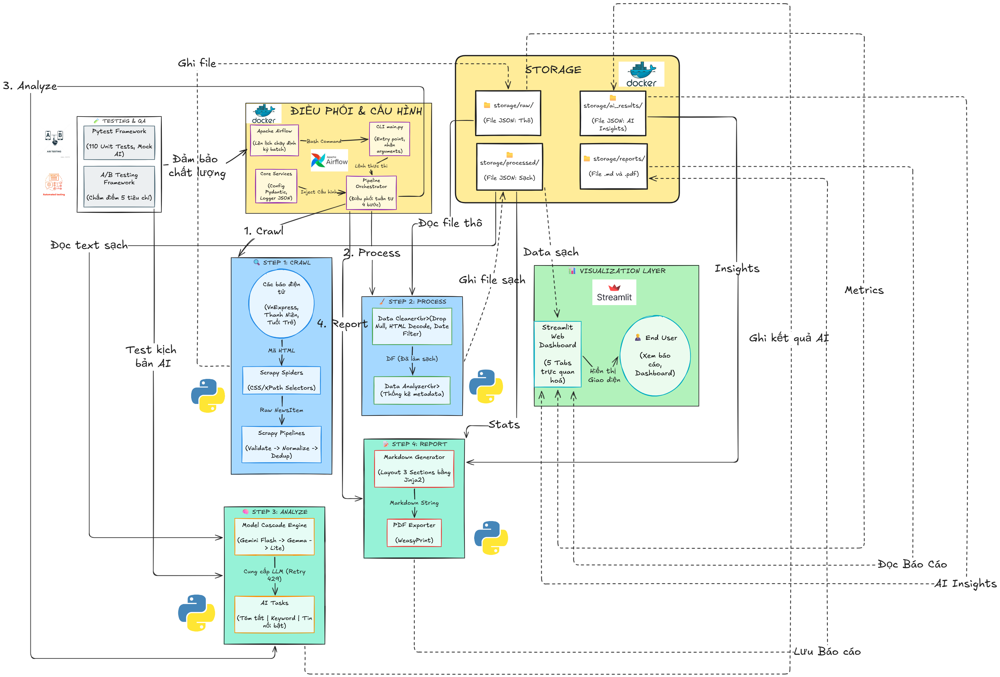
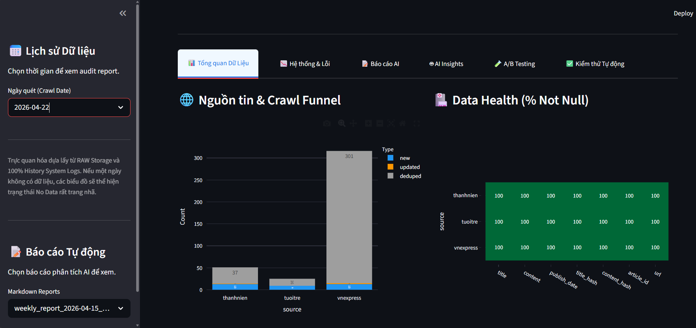
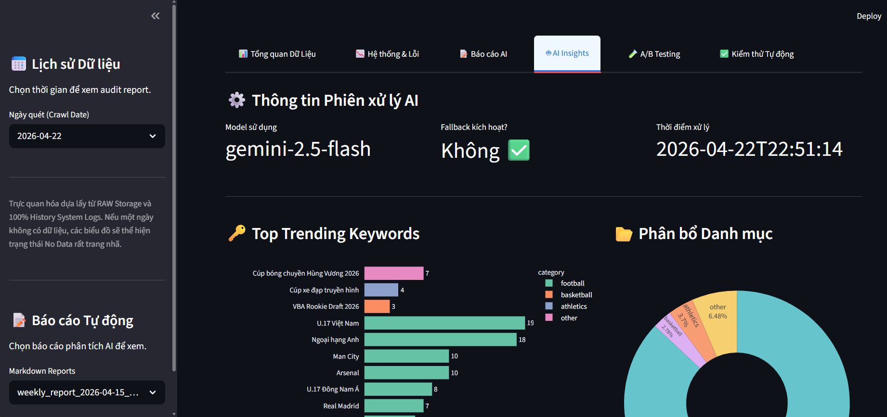
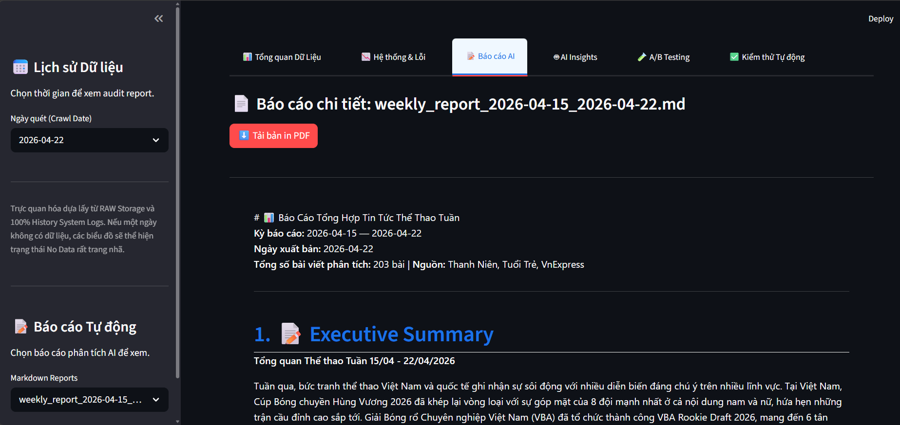
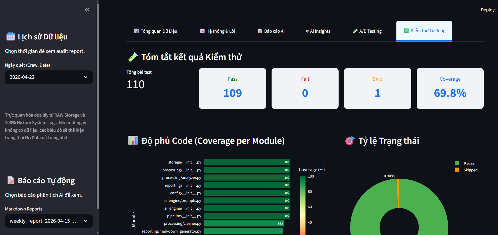
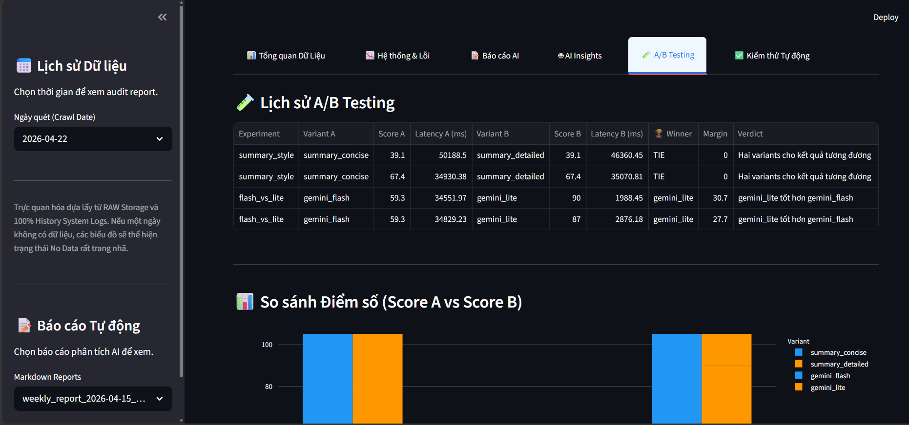
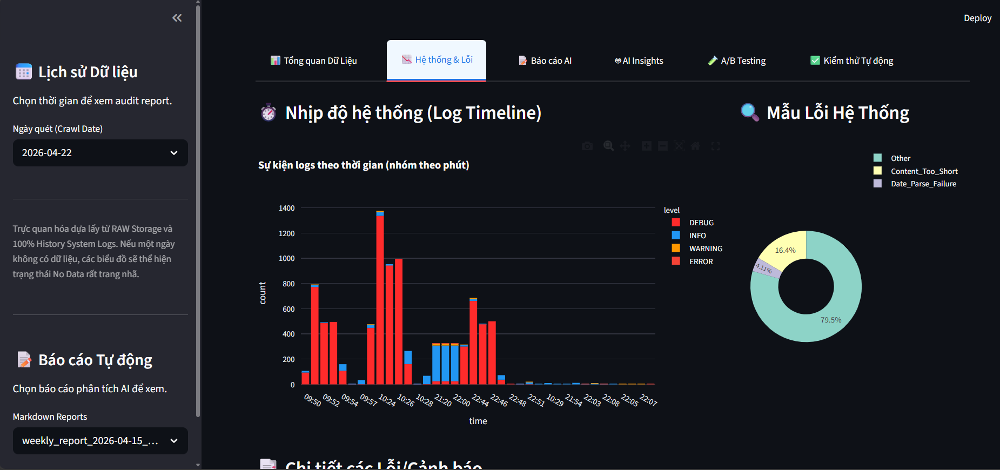

# 📰 Intelligent Sports News Assistant
**MLOps Pipeline Project for Intelligent Sports News Summary System**



---

## 1. System Overview & Context

### What does the system do?
**Intelligent Sports News Assistant** is an end-to-end automated system for collecting, processing, analyzing, and summarizing Sports news from the 3 largest electronic newspapers in Vietnam over the last 7 days.

### Core Input/Output

| Component | Description |
|-----------|-------------|
| **Input** | Stream of sports news articles from 3 sources: VnExpress (`vnexpress.net/the-thao`), Thanh Niên (`thanhnien.vn/the-thao`), Tuổi Trẻ (`tuoitre.vn/the-thao.htm`) — collected via Scrapy Spiders |
| **Output** | Weekly Summary Report (Markdown + PDF) including: Executive Summary, Trending Keywords, Highlighted News |

---

## 3. Tech Stack & Architecture Decision

| Component | Technology |
|-----------|-----------|
| **Data Crawling** | Scrapy 2.11+ |
| **Data Storage** | JSON file-based |
| **Data Processing** | Pandas 2.2+ |
| **LLM Orchestration** | LangChain 0.3+ |
| **Primary AI Model** | Google Gemini API (gemini-2.0-flash) |
| **Fallback AI Model** | OpenAI API (GPT-4o) |
| **Reporting** | Jinja2 + markdown + WeasyPrint |
| **Configuration** | python-dotenv + Pydantic Settings |
| **Monitoring** | Streamlit (Python) |
| **Orchestration** | Apache Airflow |
| **Infrastructure** | Docker & Docker Compose |
| **Logging** | Python `logging` (RotatingFileHandler) |
| **Testing** | pytest + pytest-mock |

---

## 4. Project Structure

```
/SportsNewsAssistant/
│
├── main.py                       # Main entry point — runs full pipeline
├── logger.py                     # System logging configuration
├── requirements.txt              # Dependency list
├── setup.py                      # Package setup for cross-module imports
├── pytest.ini                    # Configuration for testing framework
├── .env.example                  # Environment variable template
├── Dockerfile                    # Docker image definition
├── docker-compose.yml            # Orchestration for Docker containers
├── README.md                     # Overview documentation (this file)
│
├── config/                       # System configuration module
├── crawler/                      # Data collection module (Scrapy)
├── storage/                      # Storage module (Raw/Processed/Results)
├── processing/                   # Data processing & analysis module
├── ai_engine/                    # AI/NLP Processing module
├── reporting/                    # Report generation & publishing module
├── visualization/                # Monitoring Dashboard (Streamlit)
├── pipeline/                     # Overall pipeline orchestration module
│
├── tests/                        # Testing system (automation testing & ab_testing)
│   └── ab_testing/               # Model/Prompt comparison framework
│
├── Information/                  # Detailed documentation & Audit Reports
│   ├── REPORT.md                 # Quality assurance report
│   ├── TESTING_GUIDE.md          # Testing & A/B Test guide
│   ├── RUNBOOK_AIRFLOW.md        # Airflow operations guide
│   └── SETUP_AND_RUN.md          # Detailed setup guide
│
└── logs/                         # System operations logs
```

---

## 5. Global Data Contracts

### 5.1 Article Schema (Raw & Processed)

```json
{
  "title": "string — Article title",
  "content": "string — Full article content",
  "publish_date": "string (ISO 8601) — Publication date",
  "source": "string — News source name (vnexpress | thanhnien | tuoitre)",
  "url": "string — Original article URL",
  "crawled_at": "string (ISO 8601) — Crawl timestamp",
  "article_id": "string — SHA256 hash of URL (unique identifier)"
}
```

### 5.2 AI Processing Output Schema

```json
{
  "executive_summary": "string — Weekly overview paragraph (200-400 words)",
  "trending_keywords": [
    {
      "keyword": "string",
      "frequency": "int",
      "category": "string (football | basketball | etc.)"
    }
  ],
  "highlighted_news": [
    {
      "title": "string",
      "summary": "string",
      "url": "string",
      "relevance_score": "float (0-1)"
    }
  ],
  "model_used": "string — AI Model used for processing",
  "processing_timestamp": "string (ISO 8601)"
}
```

---

## 6. Monitoring Dashboard (Visual Interface)

The system provides a comprehensive Monitoring Dashboard via Streamlit, helping to track Pipeline status, AI quality, and test results in real-time.

### Data Overview & AI Insights



### Reports & Testing



### A/B Testing & Logs




**Main functional tabs:**
- **Data Overview:** Quantitative analysis of articles by source and time.
- **AI Insights:** Visualization of keyword trends and prominent sports entities.
- **AI Reports:** Quick view interface for Markdown reports generated from the Pipeline.
- **A/B Testing:** Visual comparison of performance and quality between Prompt/Model variants.
- **Automation Testing:** Monitor results of 109 tests and source code coverage.
- **System & Errors:** Monitor operation logs (Logs) for timely troubleshooting.

---

## 7. Quick Start Guide (CLI)

```bash
# 1. Environment Setup
pip install -r requirements.txt
cp .env.example .env

# 2. Run full pipeline
python main.py

# 3. Open Monitoring Dashboard
streamlit run visualization/app.py
```

---

## 8. Related Documentation (Ops & Audit)

- **[🚀 Setup & Launch Guide](Information/SETUP_AND_RUN.md)**
- **[🛡️ Quality Assurance Report](Information/REPORT.md)**
- **[🧪 Testing & A/B Test Handbook](Information/TESTING_GUIDE.md)**
- **[🔄 Airflow Operations Guide](Information/RUNBOOK_AIRFLOW.md)**

---
